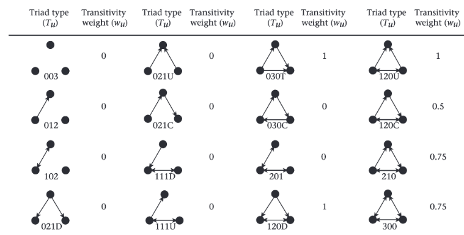

# 3. Linearityを表す指標の算出  
## 3.1 Linearityとは  
Linearityは**順位序列がどの程度直線的か**を示す指標である。直線的とは、順位序列に三すくみのような関係がないことを指す。  

linearityの指標としては、ケンドールの$K$(Kendall's $K$)とランダウの$h$(Landau's $h$)を修正したもの($h'$)がよく用いられてきた[@deVries1995]。また、近年これらに変わる指標として、triangle transitivity($t_{tri}$)が提案されている[@Shizuka2012]。  

本稿では、これらのうち$h'$と$t_{tri}$の解説を行う。  

## 3.2 ランダウのhとh'    
### 3.2.1 指標の概要  
ランダウの$h$[@Landau1951]は、個体間のdominanceのばらつきに着目した指標である。  

算出に際しては、まず個体間の勝敗データに基づいて、もし個体$i$が個体$j$に対して勝ち越しているときは$X_{ij} = 1, X_{ji} = 0$となるような隣接行列を考える。なお、勝敗数が同じ場合は$X_{ij} = X_{ji} = 0.5$とする。   

例えば、隣接行列は以下のようになる。  
```{r}
mat3 <- read.csv("matrix2.csv", row.names = 1) %>%
  ## matrix形式に変換
  as.matrix()

mat3
```
<br/>  

ここで、各個体について行の値を合計したものを$S_i$(i = 1,2,\dots,N)とする($N$は個体数)。例えば、先ほどの隣接行列で個体$C$の$S_i$は$0 + 0+0+1+0+1+1+1+1 = 4$となる。このとき、ランダウの$h$は以下の式で算出される。  

$$
h = \frac{12}{N^3 - N} \Sigma_{i = 1}^N \Bigl(S_i - (N-1)/2 \Bigl)
$$

しかし、動物の社会では<u>個体間の敵対的な交渉が一度も確認されないことがよくある</u>。例えば、以下の隣接行列では個体$B$と$F$、個体$A$と$I$、個体$C$と$I$は交渉が見られていない(Rでは`NA`で表されている)。  

```{r}
mat4 <- read.csv("matrix3.csv", row.names = 1) %>%
  ## matrix形式に変換
  as.matrix()

mat4
```
<br/>  

このように交渉がないダイアッドがあるとき、ランダウの$h$は直線性を過小評価してしまう[@deVries1995]。そこで考え出されたのが$h'$である。  

$h'$の算出の際には、**交渉が見られなかった個体の勝敗に0と1をランダムに割り当てて**$h$を計算する。これを10000回繰り返し、算出された$h$の平均をとったものが$h'$である。$h'$の期待値は以下の式のようになる[@deVries1995]。なお、$u$は交渉が見られなかったダイアッドの数である。    

$$
h' = h + \frac{6}{N^3 - N} \times u
$$

### 3.2.2 Rでの算出方法と検定  
Rでは、`EloRating`パッケージの`h.index`関数を用いて算出できる。このとき、関数に入れる隣接行列は上記で見たような1と0波で表される隣接行列でなくてもよい。例えば、前章まで使用していたデータ`mat`を用いると以下のように算出できる。  

`h index`がランダウの$h$を、`h' index`が$h'$を表す。この隣接行列では交渉が見られなかったダイアッドはなかったので、いずれも同じ値になる。また、勝敗がランダムに決まるときのlinearity(`extected h`)に比べて実際のlinearityが有意に高いかという検定をした際の$p$値が`p right`である。今回は$p = 0.001$なので有意に高いということになる。検定の際のランダム化の回数は`loop =`で指定する。検定の詳細については、 @deVries1995 を参照。  

```{r}
EloRating::h.index(mat, loops = 1000)
```
<br/>  

交渉のないダイアッドがあると$h$と$h'$の値は違くなる。例えば、先ほどの隣接行列(`mat4`)では以下のようになる。なお、算出の際には交渉がなかったダイアッドに対応する値はいずれも0としておく必要がある。`tied`/`unknown`で示されているのが、交渉のなかったダイアッドの数である。     

```{r}
## 交渉のないところは0にする
mat4[is.na(mat4)] <- 0

EloRating::h.index(mat4, loops = 1000)
```

## 3.3 triangle transitivity  
### 3.3.1 指標の概要  
$h'$の算出の際には、交渉が見られなかったダイアッドにランダムに勝敗を割り当てて指標を算出した。しかし、実際の動物の社会交渉では、交渉が生じない理由には様々なものが考えられる(e.g., 空間的隔離がある、避けている、観察時間の問題など)[@Shizuka2012]。**$h'$のように人為的に値を割り当てる方法はこれらを区別しておらず、その結果指標にバイアスが生じる可能性がある**。シミュレーションの研究から、$h'$は特に個体数が多いときには直線性を過小評価してしまうことが分かっている[@Shizuka2012]。   

そこで考案されたのが、triangle transitivity($t_{tri}$)という指標である[@Shizuka2012]。3者間の優劣関係は、全てのダイアッド間に交渉があるとき"transitive"か"cycle"のいずれかに分類できる(勝敗数が同じダイアッドがある場合は除く)。なお、図中で例えば$A \rightarrow B$のときは$A$が$B$に勝ち越していることを示している。  

"Transitive"な場合は、いわば$A >B, B>C$ならば$A>C$の状況であり、3者間の優劣関係が直線的であるときである(図\@ref(fig:triangle))。一方で、"cycle"な場合はじゃんけんの様に三すくみが生じている状況である。  

```{r triangle, fig.height = 3, fig.cap = "'Transitive'と'Cycle'", echo = FALSE}
library(dagitty)
library(ggdag)
library(patchwork)

dagify(A ~ B,
       B ~ C,
       A ~ C,
       coords = tibble(name = c("A","B","C"),
                       x = c(1,2,3),
                       y = c(1.2,1,1.2))) %>% 
  ggdag(node_size =　10, text_size = 3)+
  theme_dag(aspect.ratio = 0.8) +
  ggtitle("Transitive")+
  theme(plot.title = element_text(hjust = 0.5)) -> p1

dagify(A ~ B,
       B ~ C,
       C ~ A,
       coords = tibble(name = c("A","B","C"),
                       x = c(1,2,3),
                       y = c(1.2,1,1.2))) %>% 
  ggdag(node_size =　10, text_size = 3)+
  theme_dag(aspect.ratio = 0.8) +
  ggtitle("Cycle")+
  theme(plot.title = element_text(hjust = 0.5)) -> p2

p1 + p2
```
<br/>  

$t_{tri}$は簡単に言えば、<u>"cycle"な関係に比べて"transitive"な関係がどのくらい多いか</u>をもとに直線性を算出する指標である。$t_{tri}$の算出の際、**勝敗数が同じダイアッドがない場合**には、まず以下の式で$P_t$を求める。$N_t$は"transitive"な3者間の関係の数を、$N_c$は"cycle"な3者間の関係の数を表す。  

$$
P_t = \frac{N_{t}}{N_t + N_c}
$$

**勝敗の数が同じ(= 双方向的な)ダイアッドがあるとき**には、「3者間の関係が"transitive"になる可能性で重みづけた値($w_u$)」を用いる。図\@ref(fig:weight)はすべての3者間関係の$w_u$を示している。なお、両方向に矢印がある場合は、勝敗数が同じ双方向的な関係であったことを、矢印がない場合は交渉が見られなかったことを示す。  

双方向的な関係がない場合には、$w_u$は"transitive"ならば1、それ以外は0になる。一方で、双方向的な関係を含む場合は、いずれの個体も優位になる(= 勝ち越す)可能性が0.5であると考えて3者間関係が"transitive"になる確率を$w_u$とする。例えば、図中の120Cは下にある矢印が右向きならば"transitive"だが、左向きならば"cycle"なので$w_u = 0.5$となる。一方で、210は双方向な関係が2つあり、考えうる4通りのうち3通りで"transitive"になるので、$w_u = 0.75$となる。  

```{r weight, echo=FALSE, out.width="90%", fig.align = "center", fig.cap = "'transitive'になる可能性の重み。Shizuka & McDonald (2012) から引用。"}
  
```
<br/>  

このとき、$P_t$は以下のように計算する。なお、$N_{triangles}$は全ての3者間関係の数(ダイアッド間に交渉がないものを含む場合は除く)、$T_u$はそれぞれの3者間関係のタイプ(図\@ref(fig:weight)の`Triad type`)の数を表す。  

$$
P_t = \frac{\Sigma_{u} w_u \times T_u}{N_{triangles}}
$$

個体間の優劣関係がランダムに決まるとき、$P_t$の期待値は0.75になることが分かっている[@Shizuka2012]。そこで、$t_{tri}$は最大値が1になるように以下のように算出する($P_t \le 1$のため)。$t_{tri}$は理論上負の値になることはあるが、実際のデータをもとに算出した場合、負の値をとることは稀であることが分かっている[@Shizuka2012]  

$$
t_{tri} = 4(P_t - 0.75)
$$

$t_{tri}$は$h'$とは異なり、**個体数が増加したり交渉のないダイアッドが増えたりしてもバイアスが生じない**ことが分かっている[@Shizuka2012]。  

### 3.3.2 Rでの算出方法と検定  
Rでは`EloRating`パッケージの`transitivity`関数で求めることができる。この関数では、$t_{tri}$が個体の勝敗がランダムに決まる場合と比べて有意に高いかを検定することもできる。検定方法については、 @Shizuka2012 を参照。`runs =`で検定でランダム化を行う回数を指定する。  

例えば、前章から用いている隣接行列`mat`を用いて算出すると以下のようになる。`Pt`が$P_t$を、`ttri`が$t_{tri}$を、`p`が$p$値を表している。$h'$よりも値が若干高いことが分かる。      
```{r}
EloRating::transitivity(mat, runs = 5000)
```
<br/>  

交渉が見られないダイアッドを含む`mat4`で算出すると以下のようになる。やはり$h'$よりも値が若干高い。    
```{r}
EloRating::transitivity(mat4, runs = 5000)
```

